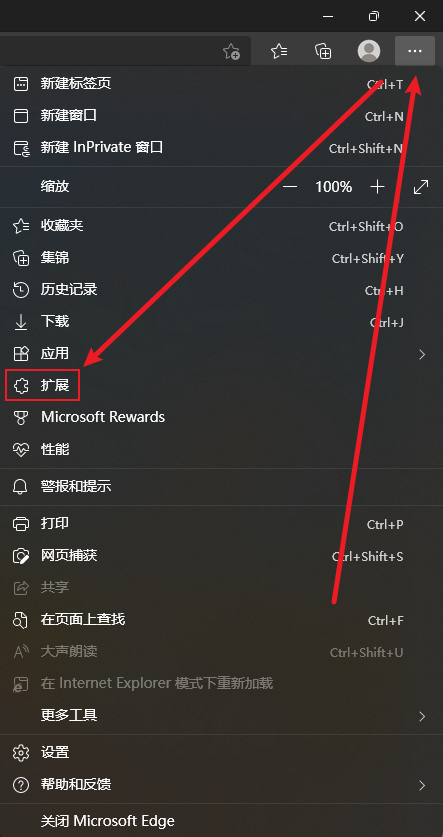
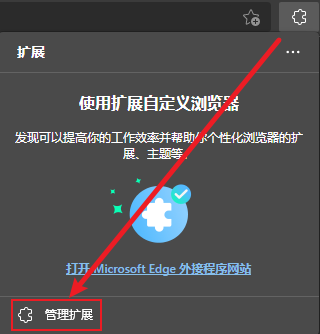

# 如何安装浏览器扩展

安装浏览器扩展可以去对应浏览器的官方扩展市场下载

也可以去第三方网站直接下载扩展文件安装进浏览器 常见后缀名如：`.crx` `.xpi`

注意：[不要随意安装网上的扩展，小心恶意扩展](Malicious%20browser%20extensions.md)

## 如何给浏览器安装第三方扩展

1. 打开各浏览器扩展程序对应页面的链接
    浏览器|扩展页面链接|扩展后缀名
    :-:|-|-
    Edge|[edge://extensions](edge://extensions/)|.crx
    Chrome|[chrome://extensions](chrome://extensions)|.crx
    FireFox|[about:addons](about:addons)|.xpi
   - 也可以通过点击浏览器右上方菜单栏中的  **设置与其他->扩展->管理扩展** 打开

      

      
图片

      
      

      

2. 打开 `开发人员模式` ~~ 和 `允许来自其他应用商店的扩展` ~~
  
3. 将扩展文件`.crx`**直接拖入扩展页面**即可安装
   - 浏览器可能提示禁止直接安装扩展

安装第三方扩展的另一种安装方式

>Chrome 21.x 系列增加了对扩展安装的限制, 自 Chrome 21.x 开始默认只允许从 Chrome Web Store （Chrome 网上应用店）安装扩展、应用及脚本

- 把下载后的`.crx`扩展名的离线 Chrome 扩展的文件扩展名改成`.zip`或者`.rar`。
- 右键点击该文件，并使用压缩软件（如7z、winrar、好压、360压缩等）对该压缩文件进行解压，并保存到系统的一个任意文件夹下。解压成功以后，该 Chrome 扩展就会以文件夹的形式存在于操作系统的某一个目录下面。***(注意：文件夹位置变动会导致扩展失效)***
- 打开扩展程序页面
- 打开 `开发者模式`
- 点击 `加载已解压的扩展程序...` 选择刚刚解压的扩展文件夹的位置即可

