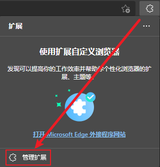

# 如何安装浏览器插件

要安装浏览器插件可以去对应浏览器的官方插件市场下载

也可以去第三方网站直接下载插件安装进浏览器 后缀名分别为`.crx` `.xpi`

::: details 如何给浏览器安装第三方插件

Edge 浏览器安装第三方插件比较简单

- 打开扩展程序页面 [edge://extensions](edge://extensions/) [chrome://extensions](chrome://extensions)
- 或是通过点击浏览器右上角退出下面的  **设置与其他** - **扩展**- **管理扩展** 打开

- 打开 `开发人员模式` 和 `允许来自其他应用商店的扩展`

- 将 .crx 文件**直接拖入扩展页面**即可安装

---

Chrome 安装第三方扩展或者 Edge 的另一种安装方式

>Chrome 21.x 系列增加了对扩展插件安装的限制, 自 Chrome 21.x 开始默认只允许从 Chrome Web Store （Chrome 网上应用店）安装扩展、应用及脚本

- 把下载后的`.crx`扩展名的离线 Chrome 插件的文件扩展名改成`.zip`或者`.rar`。
- 右键点击该文件，并使用压缩软件（如7z、winrar、好压、360压缩等）对该压缩文件进行解压，并保存到系统的一个任意文件夹下。解压成功以后，该 Chrome 插件就会以文件夹的形式存在于操作系统的某一个目录下面。***(注意：文件夹位置变动会导致插件失效)***
- 打开扩展程序页面 [edge://extensions](edge://extensions/) [chrome://extensions](chrome://extensions)
- 打开 `开发者模式`
- 点击 `加载已解压的扩展程序...` 选择刚刚解压的插件文件夹的位置即可

:::
